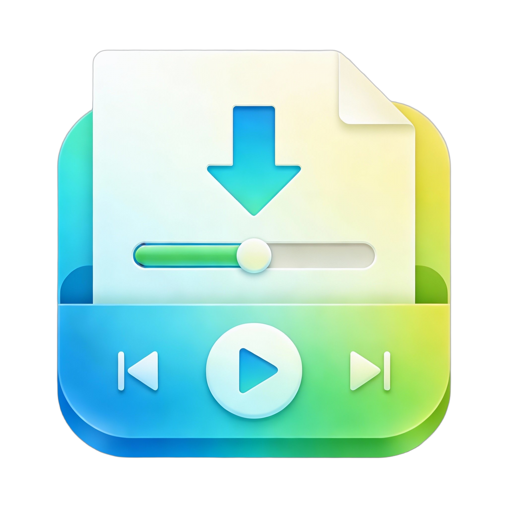
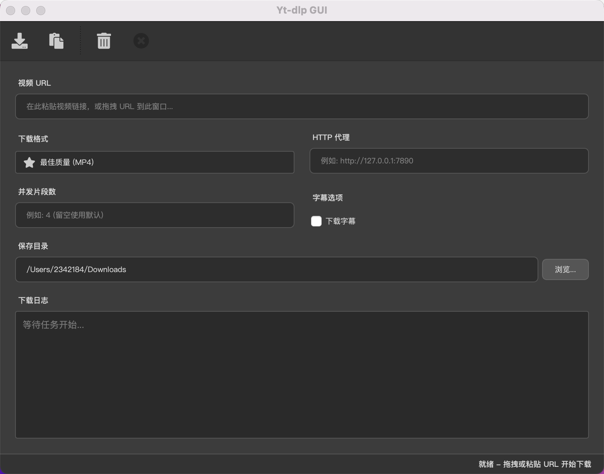

<div align="center">



# Yt-dlp Qt GUI


**A modern video download tool built with PySide6 and yt-dlp**

[English] | [简体中文](./README_zh.md)

[Features](#-features) • [Quick Start](#-quick-start) • [FAQ](#-faq) 

</div>

---

## 📖 Introduction

**Yt-dlp Qt GUI** is a lightweight, modern, cross-platform video download tool built on the powerful `yt-dlp` core and the elegant `PySide6` framework. It provides a user-friendly graphical interface, making it simple and efficient to download content from thousands of video sites like YouTube, Bilibili, Vimeo, and more.

### 🎯 Key Advantages

- **🚀 High Performance**: Utilizes a multi-threaded architecture; download tasks run in the background, keeping the UI smooth and responsive.
- **🎨 Modern Design**: Carefully crafted dark theme interface for a comfortable visual experience.
- **🔧 Highly Configurable**: Rich format presets and custom options to meet various needs.
- **🛡️ Stable & Reliable**: Robust error handling and retry mechanisms ensure tasks are completed.
- **🌐 Network Friendly**: Built-in proxy support to easily handle network restrictions.

## ✨ Features

### 🎬 Downloading
-   **Multi-platform Support**: Powered by `yt-dlp`, supporting thousands of sites including YouTube, Bilibili, Vimeo, Twitter, etc.
-   **Smart Format Selection**: Built-in presets for Best Quality, 4K, 1080p, 720p, and Audio-only downloads.
-   **Automatic Merging**: Automatically downloads the best video and audio streams and merges them into MP4 using FFmpeg.
-   **Resume Support**: Supports resuming interrupted downloads to save time and bandwidth.

### 📊 Progress & Status
-   **Real-time Progress**: Detailed progress bars showing exact percentages.
-   **Speed Monitoring**: Real-time download speed display.
-   **ETA Prediction**: Smart calculation of estimated remaining time.
-   **Detailed Logs**: Complete download logs for troubleshooting and tracking.

### ⚙️ Advanced Features
-   **Proxy Support**: Built-in HTTP/SOCKS proxy configuration.
-   **Multi-threaded**: Independent background threads for downloads.
-   **Task Cancellation**: Gracefully cancel downloads at any time.
-   **Custom Save Path**: Flexible directory selection (defaults to system Downloads folder).
-   **Retry Mechanism**: Automatic retries (up to 10 times) to improve success rates.

## 📸 Preview

<div align="center">



*Modern dark theme interface for a clean download experience*

</div>

---

## 🚀 Quick Start

### Prerequisites

-   Python 3.12 or higher
-   uv (Recommended package manager)
-   FFmpeg (Required for merging; ensure it's in your system PATH)

### Installation

1.  **Clone the Repository**
    ```bash
    git clone https://github.com/twn39/yt-dlp-qt-gui.git
    cd yt-dlp-gui
    ```

2.  **Install Dependencies**
    Recommended using `uv`:
    ```bash
    uv sync
    ```

3.  **Run the Application**
    
    Multiple ways to start:
    
    **Option 1: Using CLI (Recommended)**
    ```bash
    uv run yt-dlp-qt-gui
    ```
    
    Check version:
    ```bash
    uv run yt-dlp-qt-gui --version
    ```
    
    Help info:
    ```bash
    uv run yt-dlp-qt-gui --help
    ```

---

## 📦 Packaging

### Install Packaging Dependencies

```bash
uv sync --extra packaging
```

### Build Executable

```bash
# Using build script (Recommended)
uv run python build.py

# Or using PyInstaller directly
uv run pyinstaller --clean yt-dlp-qt-gui.spec
```

The executable will be located in the `dist/` directory.

### Cross-platform

- **Windows**: Build on Windows for `.exe`
- **macOS**: Build on macOS for app/executable
- **Linux**: Build on Linux for executable

---

## 🧪 Testing

### Running Tests

This project uses `pytest` for testing with `pytest-qt` for Qt-specific tests.

```bash
# Run all tests
uv run pytest

# Run tests with coverage
uv run pytest --cov=src/yt_dlp_gui --cov-report=html

# Run specific test file
uv run pytest tests/test_main_window.py

# Run with verbose output
uv run pytest -v

# Run specific test
uv run pytest tests/test_main_window.py::test_main_window_init
```

---

## 🛠️ Tech Stack

-   **GUI Framework**: [PySide6](https://doc.qt.io/qtforpython/) (Qt for Python)
-   **Engine**: [yt-dlp](https://github.com/yt-dlp/yt-dlp)
-   **Icons**: [QtAwesome](https://github.com/Spyder-IDE/qtawesome)
-   **CLI**: [Click](https://click.palletsprojects.com/)
-   **Packaging**: [PyInstaller](https://www.pyinstaller.org/)
-   **Package Manager**: [uv](https://github.com/astral-sh/uv)

## 📝 FAQ

### Q: What if a download fails?
A: Please check:
-   URL is correct and accessible.
-   Network connection is stable.
-   Try using a proxy if there are regional restrictions.
-   Check logs for specific error details.

### Q: Is FFmpeg mandatory?
A: Yes. FFmpeg is used to merge video and audio. Without it, some formats may not download correctly.

---

## 🤝 Contributing

Contributions, issues, and feature requests are welcome!

1.  Fork the Project
2.  Create your Feature Branch (`git checkout -b feature/AmazingFeature`)
3.  Commit your Changes (`git commit -m 'Add some AmazingFeature'`)
4.  Push to the Branch (`git push origin feature/AmazingFeature`)
5.  Open a Pull Request

---

## 📄 License

This project is licensed under the GNU General Public License v3.0 - see the [LICENSE](LICENSE) file for details.

---

## 🙏 Acknowledgments

-   [yt-dlp](https://github.com/yt-dlp/yt-dlp)
-   [PySide6](https://doc.qt.io/qtforpython/)
-   [QtAwesome](https://github.com/Spyder-IDE/qtawesome)
-   [FFmpeg](https://ffmpeg.org/)

---

## 📮 Contact

-   Open an [Issue](https://github.com/twn39/yt-dlp-qt-gui/issues)
-   Submit a [Pull Request](https://github.com/twn39/yt-dlp-qt-gui/pulls)